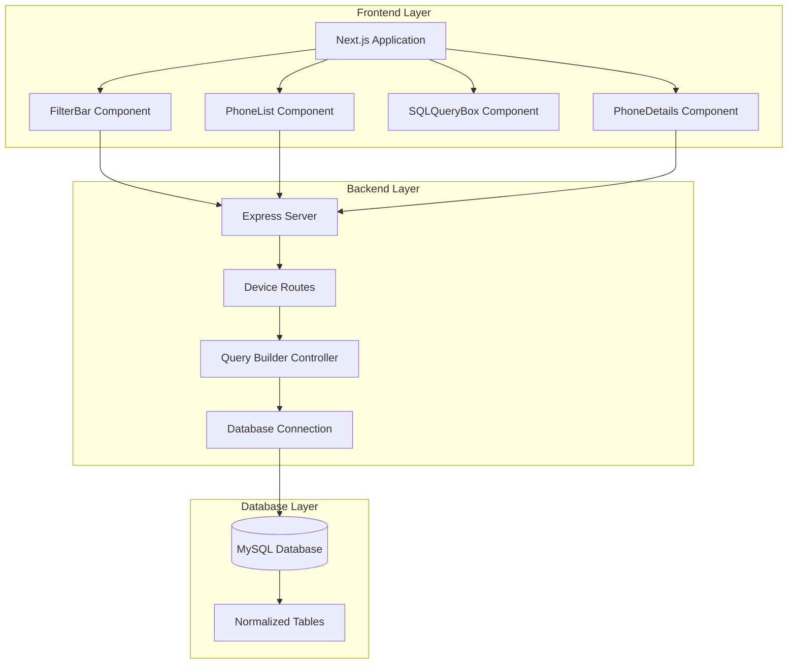

# Design Document

## Overview

The Mobile Phone Recommendation System is a full-stack web application that demonstrates database normalization principles while providing an intuitive interface for filtering and comparing mobile phones. The system uses a three-tier architecture with React/Next.js frontend, Node.js/Express backend, and MySQL database with a normalized schema following 3NF and BCNF principles.

The application transforms a flat CSV dataset with 67+ columns into a normalized relational database with 15 interconnected tables, eliminating redundancy while maintaining data integrity. Users can filter phones using multiple criteria and view the exact SQL queries executed, making it an excellent educational tool for database concepts.

## Architecture

### System Architecture Diagram



### Technology Stack

- **Frontend**: Next.js 14+ with React, Tailwind CSS for styling
- **Backend**: Node.js with Express.js framework
- **Database**: MySQL 8.0+ with mysql2 driver
- **Development**: Local development environment with GitHub deployment

## Components and Interfaces

### Frontend Components

#### FilterBar Component
```typescript
interface FilterBarProps {
  onFilterApply: (filters: FilterCriteria) => void;
  onFilterReset: () => void;
}

interface FilterCriteria {
  brand?: string;
  chipset?: string;
  displayType?: string;
  internalStorage?: string;
  priceRange?: {
    min: number;
    max: number;
  };
}
```

**Responsibilities:**
- Render horizontal filter dropdowns populated from database
- Handle user filter selections
- Trigger API calls when filters are applied
- Reset filter state

#### PhoneList Component
```typescript
interface PhoneListProps {
  phones: Phone[];
  loading: boolean;
  onPhoneSelect: (phoneId: number) => void;
  onPhoneCompare: (phoneIds: number[]) => void;
}

interface Phone {
  phone_id: number;
  brand_name: string;
  model: string;
  image_url: string;
  price_unofficial: number;
  ram_gb: number;
  internal_storage_gb: number;
  battery_capacity: number;
  display_type_name: string;
}
```

**Responsibilities:**
- Display filtered phone results in a responsive grid
- Show phone images, basic specs, and pricing
- Handle phone selection for detailed view
- Support multi-select for comparison

#### SQLQueryBox Component
```typescript
interface SQLQueryBoxProps {
  query: string;
  visible: boolean;
  executionTime?: number;
}
```

**Responsibilities:**
- Display formatted SQL queries with syntax highlighting
- Show/hide based on filter application
- Display query execution time for educational purposes

#### PhoneDetails Component
```typescript
interface PhoneDetailsProps {
  phoneId: number;
  onClose: () => void;
}

interface PhoneDetails extends Phone {
  specifications: PhoneSpecification;
  display: DisplaySpecification;
  physical: PhysicalSpecification;
  camera: CameraSpecification;
  colors: string[];
  pricing: PricingVariant[];
}
```

**Responsibilities:**
- Display comprehensive phone specifications
- Show all available colors and pricing variants
- Provide responsive modal/drawer interface

### Backend API Endpoints

#### Device Routes (`/api/devices`)

```typescript
// GET /api/devices/filters
interface FilterOptionsResponse {
  brands: { brand_id: number; brand_name: string }[];
  chipsets: { chipset_id: number; chipset_name: string }[];
  displayTypes: { display_type_id: number; display_type_name: string }[];
  storageOptions: string[];
  priceRange: { min: number; max: number };
}

// POST /api/devices/search
interface SearchRequest {
  filters: FilterCriteria;
}

interface SearchResponse {
  phones: Phone[];
  sqlQuery: string;
  executionTime: number;
  totalResults: number;
}

// GET /api/devices/:id
interface PhoneDetailsResponse {
  phone: PhoneDetails;
  sqlQuery: string;
}
```

#### Query Builder Controller

```typescript
class QueryBuilder {
  buildFilterQuery(filters: FilterCriteria): {
    query: string;
    params: any[];
  };
  
  buildDetailsQuery(phoneId: number): {
    query: string;
    params: any[];
  };
  
  buildFilterOptionsQuery(): string;
}
```

**Responsibilities:**
- Generate dynamic SQL queries based on filter criteria
- Handle complex joins across normalized tables
- Parameterize queries to prevent SQL injection
- Optimize query performance with appropriate indexes

## Data Models

### Database Schema Design

The database follows a normalized approach with 15 interconnected tables:

#### Core Entity Tables

**brands** (Eliminates brand redundancy)
```sql
CREATE TABLE brands (
    brand_id INT PRIMARY KEY AUTO_INCREMENT,
    brand_name VARCHAR(50) NOT NULL UNIQUE,
    created_at TIMESTAMP DEFAULT CURRENT_TIMESTAMP
);
```

**phones** (Main entity)
```sql
CREATE TABLE phones (
    phone_id INT PRIMARY KEY AUTO_INCREMENT,
    brand_id INT NOT NULL,
    model VARCHAR(100) NOT NULL,
    device_type VARCHAR(20) DEFAULT 'Smartphone',
    release_date DATE,
    status ENUM('Available', 'Upcoming', 'Rumored', 'Discontinued'),
    image_url VARCHAR(500),
    FOREIGN KEY (brand_id) REFERENCES brands(brand_id),
    UNIQUE KEY unique_brand_model (brand_id, model)
);
```

#### Specification Tables (3NF/BCNF Compliant)

**phone_specifications** (Technical specs)
- All non-key attributes depend only on phone_id
- Foreign keys to chipsets, operating_systems, display_types, storage_types, ram_types
- Satisfies BCNF as phone_id is the only determinant

**display_specifications** (Display-related attributes)
- Groups screen_size, resolution, pixel_density, refresh_rate, brightness
- No transitive dependencies - all attributes depend directly on phone_id

**phone_pricing** (Handles multiple price variants)
- Supports different storage/RAM configurations with different prices
- Eliminates price redundancy while maintaining variant information

#### Lookup Tables (3NF Compliant)

- **chipsets**: Eliminates chipset name redundancy
- **display_types**: Categorical display technology data
- **storage_types**: Storage technology specifications
- **ram_types**: Memory technology specifications

### Normalization Compliance

#### 3NF Compliance
- **No Transitive Dependencies**: Brand information doesn't depend on model; moved to separate brands table
- **Full Functional Dependency**: All non-key attributes depend on the complete primary key
- **Example**: In phone_specifications, RAM and storage depend entirely on phone_id, not on partial keys

#### BCNF Compliance
- **All Determinants are Candidate Keys**: Every determinant in each table is a superkey
- **Example**: In all tables, only primary keys determine other attributes
- **No Anomalies**: Insert, update, and delete operations maintain data integrity

## Error Handling

### Frontend Error Handling

```typescript
interface ErrorState {
  message: string;
  type: 'network' | 'validation' | 'server' | 'not_found';
  retryable: boolean;
}

class ErrorHandler {
  handleAPIError(error: AxiosError): ErrorState;
  displayUserFriendlyMessage(error: ErrorState): void;
  logErrorForDebugging(error: Error): void;
}
```

**Error Scenarios:**
- Network connectivity issues
- Invalid filter combinations
- Database connection failures
- Phone not found errors
- SQL query execution errors

### Backend Error Handling

```typescript
interface APIError {
  status: number;
  message: string;
  code: string;
  details?: any;
}

class ErrorMiddleware {
  handleDatabaseError(error: mysql.QueryError): APIError;
  handleValidationError(error: ValidationError): APIError;
  handleNotFoundError(resource: string): APIError;
}
```

**Error Response Format:**
```json
{
  "success": false,
  "error": {
    "code": "PHONE_NOT_FOUND",
    "message": "Phone with ID 123 not found",
    "status": 404
  }
}
```

### Database Error Handling

- **Connection Pool Management**: Handle connection timeouts and retries
- **Query Timeout Handling**: Set appropriate timeouts for complex joins
- **Foreign Key Constraint Violations**: Graceful handling of referential integrity errors
- **Duplicate Key Errors**: Handle unique constraint violations

## Testing Strategy

### Frontend Testing

#### Unit Tests (Jest + React Testing Library)
```typescript
// FilterBar.test.tsx
describe('FilterBar Component', () => {
  test('renders all filter dropdowns', () => {});
  test('populates dropdowns with API data', () => {});
  test('calls onFilterApply with correct parameters', () => {});
  test('resets filters when reset button clicked', () => {});
});

// PhoneList.test.tsx
describe('PhoneList Component', () => {
  test('displays phones in grid layout', () => {});
  test('shows loading state during API calls', () => {});
  test('handles empty results gracefully', () => {});
});
```

#### Integration Tests
- API integration with mock backend
- Filter application end-to-end flow
- Phone selection and details display
- SQL query display functionality

### Backend Testing

#### Unit Tests (Jest + Supertest)
```typescript
// queryBuilder.test.js
describe('QueryBuilder', () => {
  test('builds correct filter query for single brand', () => {});
  test('builds complex query with multiple filters', () => {});
  test('handles empty filter criteria', () => {});
  test('prevents SQL injection attacks', () => {});
});

// deviceRoutes.test.js
describe('Device Routes', () => {
  test('GET /api/devices/filters returns filter options', () => {});
  test('POST /api/devices/search returns filtered results', () => {});
  test('GET /api/devices/:id returns phone details', () => {});
});
```

#### Database Tests
- Schema validation tests
- Data integrity constraint tests
- Query performance tests
- Normalization compliance verification

### End-to-End Testing

#### User Journey Tests (Playwright/Cypress)
```typescript
describe('Phone Filtering Journey', () => {
  test('user can filter phones by brand and see results', () => {});
  test('user can view phone details by clicking on result', () => {});
  test('user can compare multiple phones', () => {});
  test('SQL query is displayed after filtering', () => {});
});
```

### Performance Testing

#### Database Query Performance
- Measure query execution times for complex joins
- Test with large datasets (1000+ phones)
- Verify index effectiveness
- Monitor connection pool usage

#### Frontend Performance
- Component rendering performance
- Image loading optimization
- API response time monitoring
- Bundle size optimization

### Educational Testing

#### Normalization Verification
```sql
-- Test 3NF compliance
SELECT COUNT(*) FROM phones p1, phones p2 
WHERE p1.phone_id != p2.phone_id 
AND p1.brand_id = p2.brand_id 
AND p1.model = p2.model; -- Should return 0

-- Test BCNF compliance
-- Verify no functional dependencies exist where determinant is not a candidate key
```

#### SQL Query Accuracy
- Verify generated queries match expected results
- Test query optimization and index usage
- Validate join correctness across normalized tables

This comprehensive testing strategy ensures the application functions correctly while serving its educational purpose of demonstrating proper database design and normalization principles.