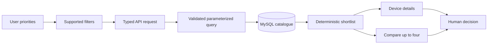
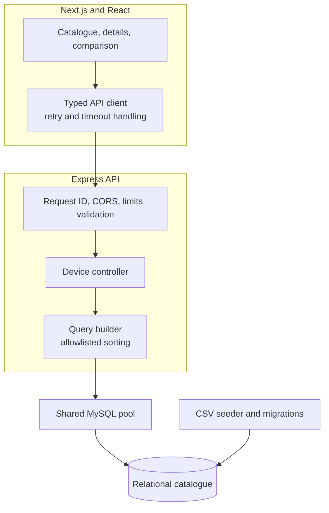

# PhoneDB

> A searchable smartphone catalogue that turns specification overload into a
> clearer shortlist for research and comparison.

[](https://nextjs.org/)
[](https://www.typescriptlang.org/)
[](https://expressjs.com/)
[](https://www.mysql.com/)

PhoneDB is a read-focused smartphone research application. It gives people a
structured way to narrow a large catalogue by price, brand, chipset, display,
storage, RAM, battery, and screen size; inspect detailed records; and compare
up to four devices side by side.

The project is designed around a recommendation-oriented idea: express what
matters, reduce the candidate set, and make the trade-offs easy to review. The
current checked-in runtime implements the reliable shortlist, detail, and
comparison workflow. It does not claim to calculate an automatic weighted
recommendation or machine-learning score.

**[Open the project showcase](https://razibit.github.io/Smartphone-Recommendation-WebApp/)** · **[Browse the repository](https://github.com/razibit/Smartphone-Recommendation-WebApp)**

## Contents

- [The problem](#the-problem)
- [The solution](#the-solution)
- [How the workflow works](#how-the-workflow-works)
- [Dataset](#dataset)
- [Capabilities](#capabilities)
- [Architecture](#architecture)
- [Technology stack](#technology-stack)
- [Repository structure](#repository-structure)
- [Run locally](#run-locally)
- [Usage](#usage)
- [Project showcase](#project-showcase)
- [Technical highlights](#technical-highlights)
- [Limitations and future direction](#limitations-and-future-direction)
- [Verification](#verification)

## The problem

Choosing a smartphone is rarely a single-spec decision. A buyer may need to
balance price, memory, storage, battery capacity, display characteristics,
processor, camera details, brand preference, availability, and model variants
across hundreds of devices. Manufacturer pages and review sites make those
facts available, but they do not make the trade-offs easy to compare in one
consistent workflow.

PhoneDB treats that comparison problem as a data and interface problem: make
the attributes structured, make the constraints explicit, and keep the path
from a broad catalogue to a small set of plausible devices visible.

## The solution

The application combines a compiled smartphone dataset, a relational MySQL
schema, a typed Express API, and a responsive Next.js interface. Users can
apply supported requirements, review a deterministic paginated result set,
open a full device record, and compare a small selection without copying
specifications between browser tabs.

The result is a practical decision-support surface rather than a claim of
automated purchasing advice. The current implementation is strongest at
structured filtering and transparent comparison; an explicit ranking layer is
left as a future extension instead of being implied by the UI.

## How the workflow works



1. A user opens the catalogue and chooses supported constraints such as brand,
   chipset, display type, storage, RAM, battery, screen size, and price.
2. The frontend sends a typed request to the Express API. Request validation
   rejects malformed ranges, IDs, pagination, and unsupported sort fields.
3. The API builds parameterized MySQL queries. List and count queries share the
   same filter semantics, and results use deterministic ordering.
4. The interface shows the shortlist with pagination. A user can open details
   for complete specifications, colours, and pricing variants.
5. Up to four devices can be selected for side-by-side comparison. The user
   remains in control of the final choice.

## Dataset

The tracked seed file is [`data/phones.csv`](data/phones.csv). It is a compiled
snapshot of publicly available smartphone information collected through web
scraping. Each row retains source-oriented fields such as `detail_url`,
`image_url`, and `scraped_at`, which make the provenance visible in the data
model.

The intended collection window was 2012–2025. The current CSV contains 4,144
rows, 72 columns, and 77 brand labels when measured directly from the checked-in
file. It also contains a small number of older, future-dated, and
non-standard release-date values; the dataset should therefore be understood
as a historical snapshot, not as a completeness or freshness guarantee.

Available attributes include:

- identity: brand, model, device type, release status, source URL, image URL;
- platform: chipset, CPU, GPU, operating system, RAM, storage, connectivity;
- display: type, size, resolution, pixel density, refresh rate, brightness;
- camera and media: primary camera resolution, features, autofocus, flash, and
  video fields;
- physical and power: dimensions, weight, IP information, battery, and charging;
- commercial context: official/unofficial prices, historical price fields,
  colours, and variant descriptions.

The repository includes the dataset and its MySQL ingestion path, but not the
original collection crawler. Replacing the CSV requires review of its schema,
parser assumptions, duplicate keys, and value formats; see the [data guide](data/README.md).

## Capabilities

- Filter by brand, chipset, display type, minimum storage, minimum RAM,
  minimum battery, screen-size range, and price range.
- Browse a deterministic, paginated catalogue.
- Inspect a detailed device view with grouped technical specifications,
  colours, pricing variants, source information, and real API diagnostics when
  explicitly enabled for development.
- Select and compare up to four devices in a responsive comparison workspace.
- Retry recoverable API failures and present bounded, user-readable error
  states when the API or database is unavailable.
- Seed a local MySQL database with idempotent upserts and transactional device
  processing.

## Architecture

PhoneDB is intentionally split into a browser application, an API service, and
the database lifecycle tooling around MySQL.



The backend boundary is documented in [docs/architecture.md](docs/architecture.md).
The API surface, response envelopes, and diagnostics policy are documented in
[docs/api.md](docs/api.md).

## Technology stack

| Area | Technologies |
| --- | --- |
| Web | Next.js 16, React 19, TypeScript, Tailwind CSS 4 |
| API | Express 4, TypeScript, CORS middleware |
| Data | MySQL, mysql2, forward-only SQL migrations |
| Ingestion | Node.js streams, csv-parser, transactional upserts |
| Quality | ESLint, TypeScript checks, Node test runner, integration test hooks, production build |
| Presentation | Static GitHub Pages source in [`docs/index.html`](docs/index.html) |

## Repository structure

```text
.
├── data/
│   ├── phones.csv                 # Checked-in seed snapshot
│   └── README.md                 # Dataset handling notes
├── docs/
│   ├── index.html                 # Static GitHub Pages showcase
│   ├── showcase.css               # Showcase visual system
│   ├── showcase.js                # Progressive demo interactions
│   ├── architecture.md            # Runtime and data flow
│   ├── api.md                     # Endpoint reference
│   ├── database.md                # Schema, migrations, and seed lifecycle
│   ├── operations.md              # Configuration and operating guidance
│   └── assets/                    # Architecture and query-flow visuals
├── mobile-phone-app/
│   ├── backend/                   # Express service and MySQL lifecycle
│   ├── src/                       # Next.js application
│   ├── tests/                     # Unit, app-factory, and MySQL test hooks
│   ├── .env.example               # Safe configuration template
│   └── package.json               # Development and verification commands
├── CONTRIBUTING.md
├── SECURITY.md
└── README.md
```

## Run locally

### Prerequisites

- Node.js 20.19 or newer;
- a local MySQL service for migrations, seeding, readiness, and real data-flow
  verification;
- a database account allowed to create the configured local database.

### Configure and initialize

From the repository root:

```powershell
Copy-Item mobile-phone-app/.env.example mobile-phone-app/.env.local
Set-Location mobile-phone-app
npm install
```

Edit `.env.local` and set `DB_USER`, `DB_PASSWORD`, and `DB_NAME`. Then apply
the schema and seed the local database:

```powershell
npm run db:setup
```

The default seed source is `../data/phones.csv`. To run a controlled local
sample, pass a path and row limit:

```powershell
npm run seed -- ../data/phones.csv 25
```

### Start the services

Use two terminals from `mobile-phone-app`:

```powershell
# Terminal 1
npm run backend

# Terminal 2
npm run dev
```

Open `http://localhost:3000`. The API listens on `http://localhost:3001` by
default. Liveness and readiness can be checked with:

```powershell
Invoke-RestMethod http://localhost:3001/health/live
Invoke-RestMethod http://localhost:3001/health/ready
```

## Usage

1. Open **Browse Phones**.
2. Load the available catalogue values and select the constraints that matter.
3. Apply filters and review the result count and pagination state.
4. Open **Details** for complete specifications, pricing variants, colours,
   and source information.
5. Select up to four phones and open **Compare** to review differences.

The interface never substitutes invented records when the API is unavailable.
It shows a retryable error state instead.

## Project showcase

The static showcase in [`docs/index.html`](docs/index.html) is designed for
GitHub Pages. It is a visual project presentation, not a deployed copy of the
Next.js/MySQL application. It includes a concise problem statement, a
recommendation-oriented workflow, dataset evidence, an interactive static
shortlist demonstration, architecture visuals, technical notes, limitations,
and direct links back to the repository documentation.

To publish it through GitHub Pages, select the repository’s `main` branch and
the `/docs` folder as the Pages source in repository settings. The source is
fully static and does not require Node.js, MySQL, or a running API.

## Technical highlights

- **Data acquisition boundary:** source URLs and scrape timestamps remain
  attached to the compiled dataset while ingestion validates and normalizes
  values before persistence.
- **Relational catalogue:** shared lookup values are separated from
  device-specific specifications, colours, and pricing variants.
- **Query correctness:** filter and count semantics are shared; price ranges,
  numeric conversions, deterministic ordering, and sort-field allowlists are
  tested.
- **Service boundary:** the Express app is created through a testable factory,
  uses one bounded MySQL pool, emits request IDs, and exposes liveness and
  readiness checks.
- **Operational safety:** database credentials are required through the
  environment, diagnostics are development-only, error responses are bounded,
  and destructive database cleanup requires an explicit non-production flag.

## Limitations and future direction

Current boundaries are deliberate:

- the checked-in runtime is read-focused and has no accounts, administration,
  write API, or external commerce integration;
- automatic weighted ranking and a single primary recommendation are not yet
  implemented by the current backend;
- the original scraper is not part of this repository, so the CSV is a static
  snapshot rather than a continuously refreshed feed;
- real migration, seed, readiness, and end-to-end data-flow verification
  require a local MySQL service;
- the GitHub Pages site demonstrates the project but does not connect to the
  local API or pretend to be a live deployment.

Reasonable next steps would be an explicit ranking specification, a reproducible
collection pipeline, stronger dataset quality reports, and a carefully designed
write/authentication model if the product scope expands.

## Verification

Run from `mobile-phone-app`:

```powershell
npm run typecheck
npm run lint
npm test
npm run test:integration
npm run build
npm run verify
npm audit --audit-level=high
```

`npm run verify` is the local aggregate check. MySQL integration tests are
skipped unless a disposable MySQL environment is explicitly configured; the
repository does not replace that evidence with mock data.

## Documentation

- [Architecture](docs/architecture.md)
- [API reference](docs/api.md)
- [Database guide](docs/database.md)
- [Operations guide](docs/operations.md)
- [Contribution guide](CONTRIBUTING.md)
- [Security policy](SECURITY.md)
- [Static showcase source](docs/index.html)
